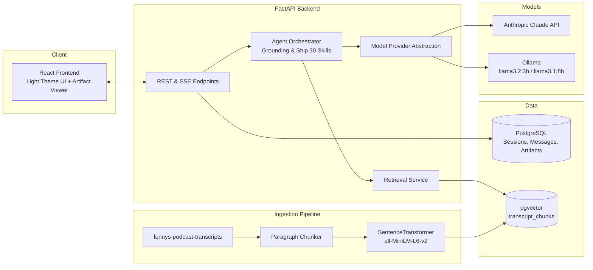

# Architecture & Technical Specification — The Lenny Growth Assistant

**Related docs:** [`PRD.md`](./PRD.md) · [`design.md`](./design.md) · [`README.md`](../README.md)

---

## 1. System Overview



---

## 2. Component Boundaries & Responsibilities

| Component | Technology | Responsibilities |
|---|---|---|
| **Frontend** | React 18, Vite, Nginx | Modern Light Theme UI, session navigation, inline rename/delete, SSE streaming chat, sandboxed artifact viewer |
| **API Layer** | FastAPI, Uvicorn | Session CRUD (`/sessions`), SSE chat endpoint (`/sessions/{id}/messages`), artifact generation (`/sessions/{id}/artifacts`), health checks |
| **Agent Layer** | Python `AgentOrchestrator` | Evaluates retrieval confidence against `GROUNDING_THRESHOLD = 0.38`, constructs grounded prompts, executes Ship 30 essay skill with structural validation |
| **Model Provider** | `ModelProvider` Base Class | Single interface implemented by `OllamaProvider` (local) and `AnthropicProvider` (cloud), switchable via `LLM_PROVIDER` env var |
| **Retrieval Service** | `SentenceTransformer`, `pgvector` | Lazy-loads `all-MiniLM-L6-v2` embedding model, executes top-$k$ vector similarity search over `transcript_chunks`, computes aggregate confidence score |
| **Database** | PostgreSQL 16 + `pgvector` | Schema for `users`, `sessions`, `messages`, `message_citations`, `artifacts`, and `transcript_chunks` |

---

## 3. Database Schema

```sql
-- PostgreSQL with pgvector extension
CREATE EXTENSION IF NOT EXISTS vector;

CREATE TABLE users (
    id UUID PRIMARY KEY DEFAULT gen_random_uuid(),
    display_name TEXT NOT NULL,
    created_at TIMESTAMPTZ NOT NULL DEFAULT NOW()
);

CREATE TABLE sessions (
    id UUID PRIMARY KEY DEFAULT gen_random_uuid(),
    user_id UUID REFERENCES users(id) ON DELETE CASCADE,
    title TEXT NOT NULL,
    active_provider TEXT NOT NULL,
    created_at TIMESTAMPTZ NOT NULL DEFAULT NOW(),
    updated_at TIMESTAMPTZ NOT NULL DEFAULT NOW()
);

CREATE TABLE messages (
    id UUID PRIMARY KEY DEFAULT gen_random_uuid(),
    session_id UUID REFERENCES sessions(id) ON DELETE CASCADE,
    role TEXT NOT NULL,
    content TEXT NOT NULL,
    provider TEXT,
    model_name TEXT,
    latency_ms INT,
    retrieval_score FLOAT,
    created_at TIMESTAMPTZ NOT NULL DEFAULT NOW()
);

CREATE TABLE transcript_chunks (
    id UUID PRIMARY KEY DEFAULT gen_random_uuid(),
    episode_slug TEXT NOT NULL,
    episode_title TEXT NOT NULL,
    guest_name TEXT NOT NULL,
    source_path TEXT NOT NULL,
    approx_timestamp TEXT,
    chunk_index INT NOT NULL,
    content TEXT NOT NULL,
    embedding vector(384),
    UNIQUE(source_path, chunk_index)
);

CREATE TABLE message_citations (
    id UUID PRIMARY KEY DEFAULT gen_random_uuid(),
    message_id UUID REFERENCES messages(id) ON DELETE CASCADE,
    chunk_id UUID REFERENCES transcript_chunks(id) ON DELETE SET NULL,
    relevance_score FLOAT NOT NULL
);

CREATE TABLE artifacts (
    id UUID PRIMARY KEY DEFAULT gen_random_uuid(),
    message_id UUID REFERENCES messages(id) ON DELETE CASCADE,
    kind TEXT NOT NULL,
    content TEXT NOT NULL,
    word_count INT NOT NULL,
    structure_valid BOOLEAN NOT NULL DEFAULT TRUE,
    created_at TIMESTAMPTZ NOT NULL DEFAULT NOW()
);
```

---

## 4. API Endpoints Contract

### System & Configuration
- `GET /health` — Simple health check (`{"data": {"status": "ok"}}`)
- `GET /health/ready` — Checks DB connection and LLM provider availability
- `GET /config` — Returns active provider and model name (`{"active_provider": "ollama", "active_model": "llama3.2:3b"}`)

### Sessions & Messages
- `POST /sessions` — Creates a new chat session
- `GET /sessions` — Lists all sessions ordered by `updated_at DESC`
- `GET /sessions/{session_id}` — Retrieves session details and message history with citations
- `PATCH /sessions/{session_id}` — Renames a session title inline
- `DELETE /sessions/{session_id}` — Deletes a session and its associated chat history
- `POST /sessions/{session_id}/messages` — SSE streaming chat endpoint returning retrieval, content, and done events

### Artifacts
- `POST /sessions/{session_id}/artifacts` — Generates a Ship 30 essay artifact with server-side validation
- `GET /artifacts/{artifact_id}` — Retrieves a persisted artifact by ID

---

## 5. Security & Sandboxing Architecture

1. **Strict Iframe Sandboxing:** HTML artifacts are rendered inside an `iframe` with **`sandbox="allow-same-origin"` ONLY**. Attributes like `allow-scripts`, `allow-popups`, and `allow-top-navigation` are strictly prohibited.
2. **XSS Sanitization:** `sanitize_markdown_html()` strips `<script>` tags, inline event handlers (`onerror`, `onclick`), and `javascript:` pseudo-protocol URLs.
3. **Structured Logging Privacy:** Request logs redact raw message bodies at default verbosity while capturing request IDs, latencies, and retrieval scores.
